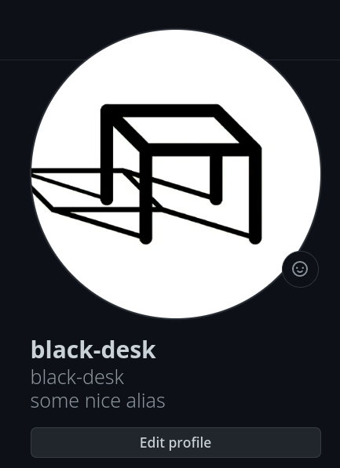

# github id alias

This is a simple extension show alias on github profile.

In option you can set a url, for example
<https://raw.githubusercontent.com/black-desk/github-id-alias/master/example.json>,
from which this plugin will fetch a json which record the aliases for github id.

Such as:

``` json
{
  "black-desk": "==="
}
```

It will look like:


